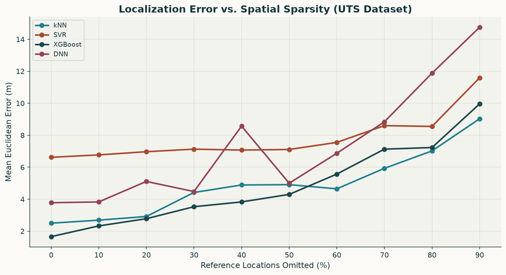
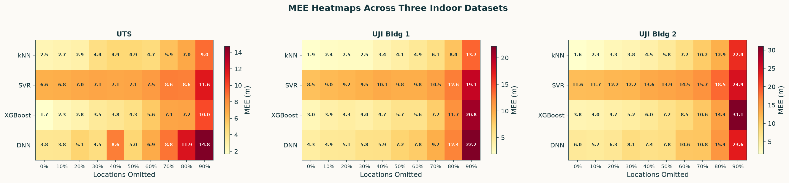
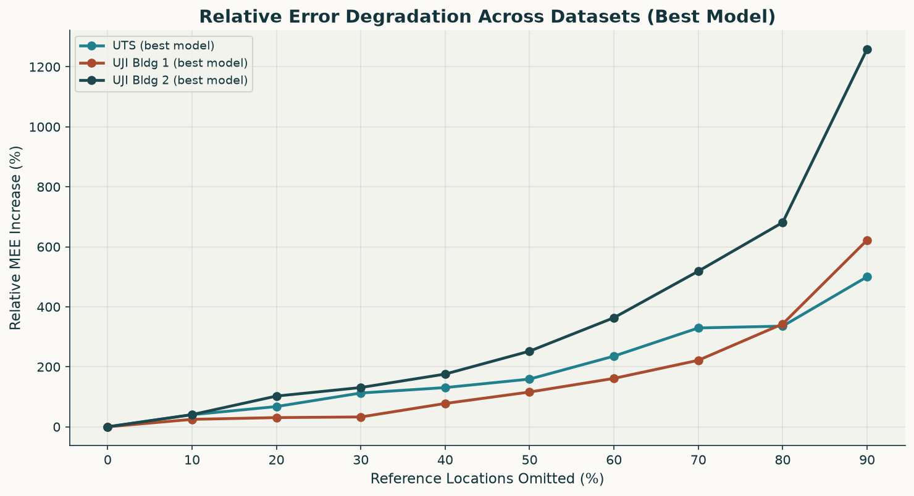
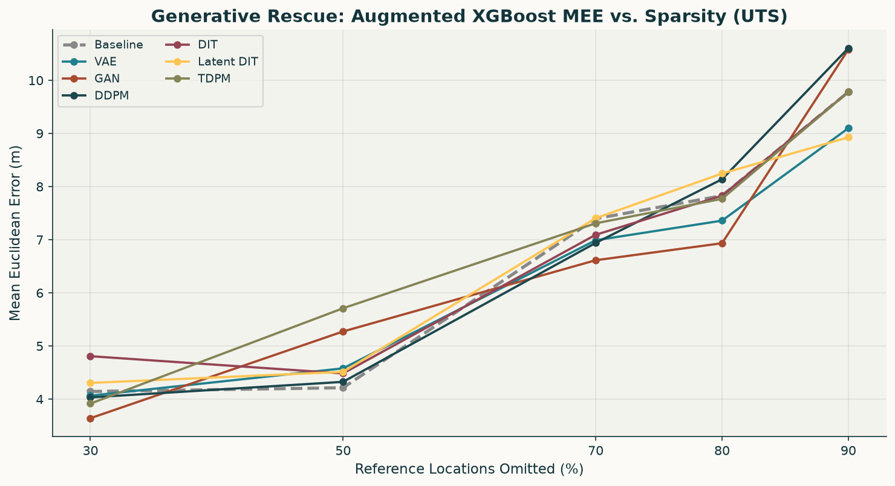
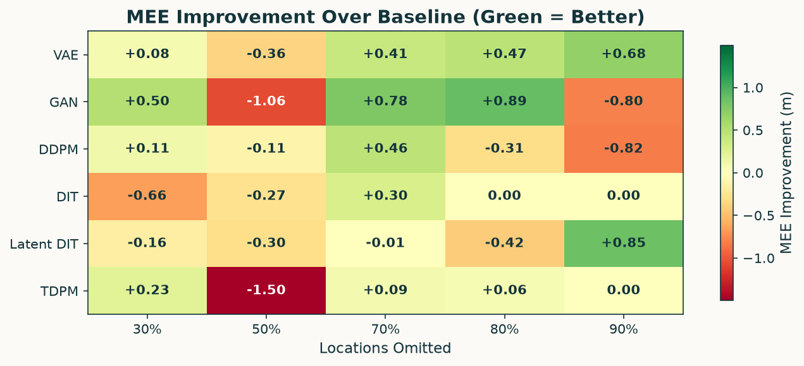
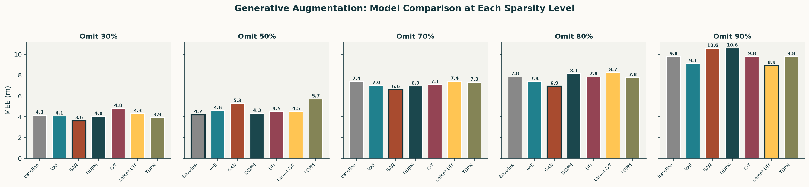

# Generative Data Augmentation for WiFi Fingerprint Localization Under Spatial Sparsity

This repository investigates how **spatial sparsity** degrades WiFi fingerprint-based indoor localization and whether **generative data augmentation** can rescue positioning accuracy when reference data is scarce.

## Problem Statement

WiFi fingerprint localization relies on dense radio maps: RSSI vectors collected at many known reference points. In practice, collecting these fingerprints is labor-intensive and expensive. When reference locations are sparse, localization accuracy degrades significantly. This project systematically quantifies that degradation and proposes a generative augmentation pipeline to mitigate it.

## Methodology

The project is structured as a two-phase study:

### Phase 1: Sparsification Ablation Study

We systematically remove 10%&ndash;90% of reference locations using **farthest-point thinning** (a deterministic strategy that guarantees uniform spatial coverage reduction) and measure the impact on four regression models:

| Model | Type | HPO |
|-------|------|-----|
| **kNN** | k-Nearest Neighbors | Optuna (k, weights) |
| **SVR** | Support Vector Regression (RBF) | Optuna (C, gamma) |
| **XGBoost** | Gradient Boosted Trees | Optuna (n_estimators, depth, lr) |
| **DNN** | 3-layer neural network (256-128-64) | Optuna (lr, dropout) |

Each model is evaluated with two feature tracks:
- **Full**: All APs with >5% coverage (dead-AP removal only)
- **Selected**: Tree-based feature selection (ExtraTreesRegressor, median threshold)

This study is replicated across **three independent indoor datasets** to validate generalizability.

### Phase 2: Generative Rescue Pipeline

For the best-performing regressor under sparsity, we train six generative models on the sparse data to synthesize fill-in WiFi fingerprints:

| Model | Architecture | Reference |
|-------|-------------|-----------|
| **VAE** | Variational Autoencoder | Suroso et al., ECTI-CON 2022 |
| **GAN** | WGAN-GP | Njima et al., IEEE Access 2022 |
| **DDPM** | Denoising Diffusion Probabilistic Model | Guo et al., CCDC 2023 |
| **DIT** | Diffusion Transformer | Yan et al., SPIE 2025 |
| **Latent DIT** | Latent Diffusion Transformer | Proposed |
| **TDPM** | Tabular Diffusion Probabilistic Model | Zhumagali et al., 2025 |

The rescue pipeline per generative model:
1. Train generative model on sparse real data
2. Generate synthetic WiFi fingerprints
3. Quality filter (sparsity mask + KNN gate)
4. Pseudo-label with XGBoost trained on sparse data
5. Combine synthetic + real data, retrain regressor
6. Evaluate on fixed test set

## Datasets

| Dataset | Source | Samples | APs | Unique Locations | No-Signal Value |
|---------|--------|--------:|----:|------------------:|:------:|
| **UTS** | UTSIndoorLoc | 522 | 206 | 198 | 100 |
| **UJI Bldg 1** | UJIndoorLoc | 1,577 | 149 | 73 | -105 |
| **UJI Bldg 2** | UJIndoorLoc | 1,396 | 190 | 79 | -105 |

## Key Results

### Sparsification: Error Degradation Across Models

All models degrade monotonically with increasing sparsity, but at very different rates. XGBoost and kNN consistently outperform SVR and DNN.



**MEE (m) for all models at each sparsity level (UTS, Full features):**

| Model | 0% | 10% | 20% | 30% | 50% | 70% | 90% |
|-------|---:|----:|----:|----:|----:|----:|----:|
| **kNN** | 2.50 | 2.69 | 2.92 | 4.42 | 4.91 | 5.93 | **9.03** |
| **SVR** | 6.62 | 6.77 | 6.97 | 7.13 | 7.11 | 8.60 | 11.59 |
| **XGBoost** | **1.66** | **2.33** | **2.78** | **3.53** | 4.30 | 7.13 | 9.96 |
| **DNN** | 3.78 | 3.83 | 5.11 | 4.48 | 5.00 | 8.84 | 14.75 |

### Cross-Dataset Heatmaps

The pattern is consistent across all three datasets: errors scale super-linearly beyond ~50% omission.



### Relative Degradation Across Datasets

Even though absolute error levels differ, the *relative* degradation pattern is strikingly similar across environments. The best model's MEE increases 5&ndash;13x at 90% omission.



### Generative Rescue: Can Synthetic Data Help?

At moderate sparsity (30&ndash;70%), generative augmentation provides meaningful improvements. GAN shows the strongest gains at 30% omission, while VAE and Latent DIT perform best at extreme sparsity (80&ndash;90%).



### Improvement Heatmap

Green cells indicate where augmentation beats the baseline; red cells indicate where it hurts.



**Key findings from the generative rescue:**
- At **30% omission**, GAN reduces MEE by 0.50 m (12% improvement), and all models except DIT help
- At **70% omission**, GAN, VAE, and DDPM all reduce MEE, with GAN delivering -0.78 m
- At **80% omission**, GAN (-0.89 m) and VAE (-0.47 m) still improve over baseline
- At **90% omission**, Latent DIT (-0.85 m) and VAE (-0.68 m) provide the best rescue
- No single generative model dominates at all sparsity levels

### Model Comparison by Sparsity Level



## Repository Structure

```
wifi_localization/
├── FINAL_sparsification_study_UTS.ipynb      # Sparsification study (UTS dataset)
├── sparsification_uts-2.ipynb                # Sparsification study (UTS, variant)
├── sparsification_uj1-2.ipynb                # Sparsification study (UJI Building 1)
├── sparsification_uj2-2.ipynb                # Sparsification study (UJI Building 2)
├── augmentation_experiment_UTS_1.ipynb        # Generative rescue pipeline (UTS)
├── generative_rescue_9.ipynb                  # Generative rescue pipeline (UTS, full)
├── generative_rescue_uts_2.ipynb              # Generative rescue pipeline (UTS, v2)
├── generative_rescue_uj2_2.ipynb              # Generative rescue pipeline (UJI Bldg 2)
├── generative_rescue_results_reconstructed.json  # Aggregated rescue results
├── uts_dataset.csv                            # UTS indoor localization dataset
├── uj_building1.csv                           # UJIndoorLoc Building 1
├── uj_building2.csv                           # UJIndoorLoc Building 2
├── ResultsPoster.pdf                          # Research poster
├── assets/                                    # Generated plots for this README
└── LICENSE                                    # Apache 2.0
```

## Technical Details

### Farthest-Point Thinning

Instead of random omission (which could wipe out entire regions), reference locations are ordered by farthest-point sampling starting from the centroid. The first points form the most spatially spread-out skeleton; the last points are dense fill-ins. Omitting X% means dropping the last X% of this ordering, guaranteeing uniform spatial thinning.

### Quality Filtering for Synthetic Data

Generated fingerprints pass through a two-stage quality gate:
1. **Sparsity mask**: Ensures the AP activation pattern (which APs are "heard") matches the distribution of real data
2. **KNN gate**: Rejects synthetic samples whose RSSI vectors are too far from any real training sample in feature space

### Evaluation Protocol

- Fixed 60/20/20 train/val/test split (stratified by location)
- Training and validation are filtered by kept locations; test always uses the full dense grid
- Hyperparameter optimization via Optuna (TPE sampler, 10 trials per configuration)
- Metric: Mean Euclidean Error (MEE) in meters, plus P50 and P90 percentiles

## Requirements

- Python 3.10+
- PyTorch
- scikit-learn
- XGBoost
- Optuna
- matplotlib, numpy, pandas, scipy

All notebooks are designed to run on Google Colab with GPU acceleration.

## License

Apache License 2.0. See [LICENSE](LICENSE) for details.
